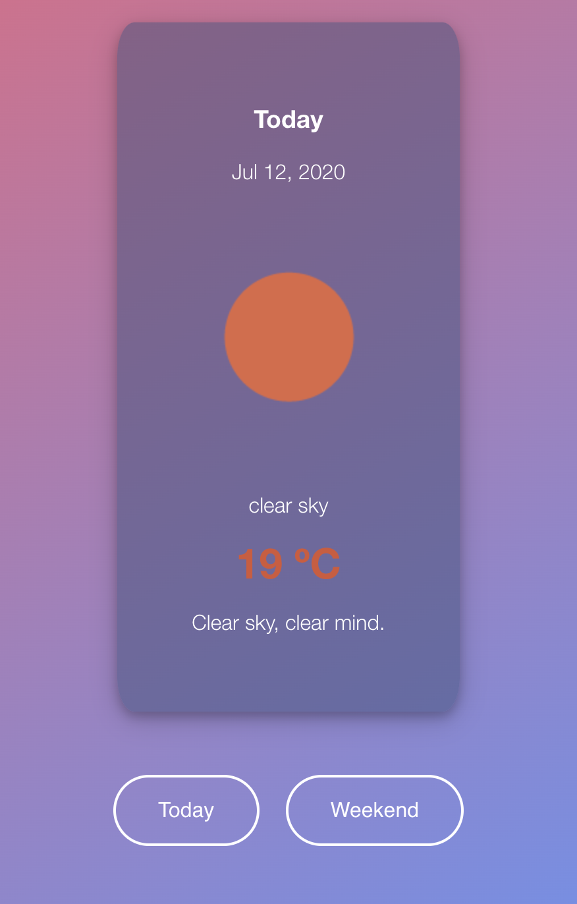

Run `npm install` and `npm start` in order to start locally

Runs the app in the development mode.
Open http://localhost:3000 to view it in the browser.

The page will reload if you make edits.
You will also see any lint errors in the console.

The project uses openweathermap API
https://openweathermap.org/api/hourly-forecast

It is currently deployed at: https://weatherapp.iammmai.vercel.app/
